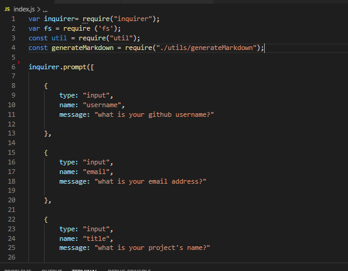
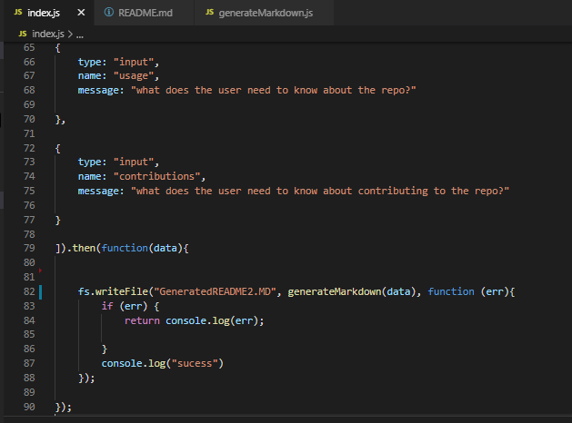
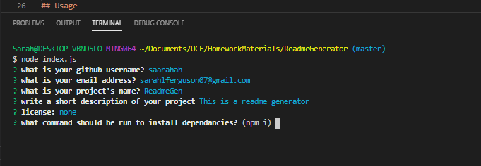
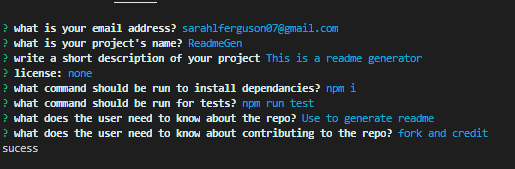
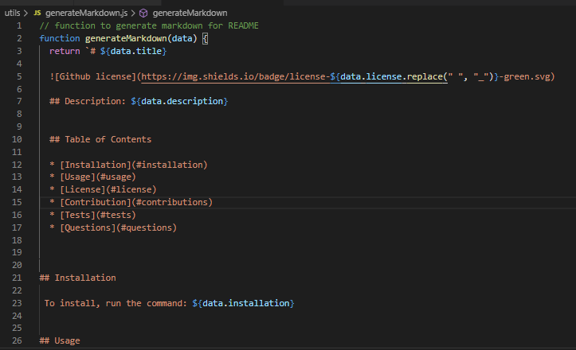
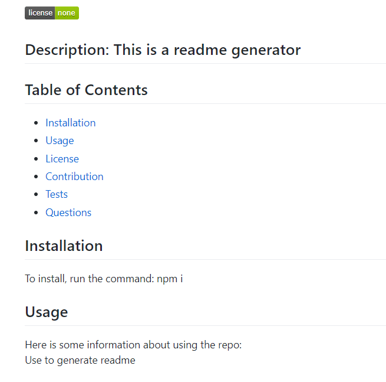

# Good Readme Generator

  

  ## Description: 
  
  This project is a good readme generator. It was created using inquirer, fs, and node.js. The project uses inquirer to prompt the user for questions regarding the nature of their project. After the questions are answered a markdown file is generated. The file generate markdown contains a template literal that uses information from the inputs in index.js. Once completed a markdown file called GeneratedREADME.MD is made.
  
  
  ## Table of Contents 
  
  * [Installation](#installation) 
  * [Usage](#usage)
  * [License](#license)
  * [Contribution](#contributions)
  * [Tests](#tests)
  * [Questions](#questions)

  
  
## Installation
  
 To install, run the command: npm i
  
  
## Usage 
  
The repo contains files used to generate markdown files in the format of a readme. Included are an index.js which uses inquirer to ask a user questions, a generatemarkdown.js which uses a template literal to add the input into a readme format and the package.json and node module dependancies. To use this project you must have node.js, install the dependencies and run "node index.js"
  
  
 ## License
  
This project is licensed under none.
  

## Contributions
  
No contributions
  
## Screenshots

 
Index.js file with inquirer prompts
 

 
Index.js file with fs write file
 

 
questions prompted in terminal
 

 
more questions
 

 
example of generated markdown file
 

 
final format image

 ## Questions

 If you have any questions email me at sarahlferguson07@gmail.com
  
 My Github account is https://github.com/saarahah
  
  
  ---
  © 2020
  
  

